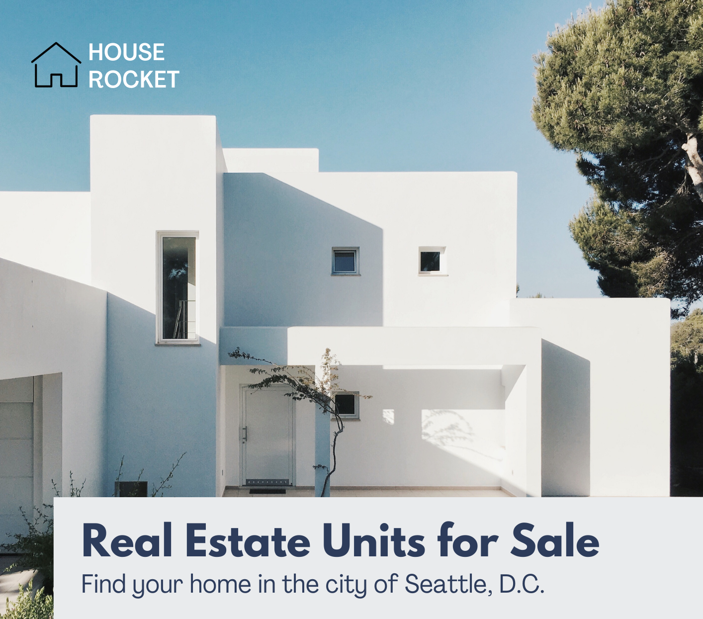

<h1 align="center">
    
</h1>

<h4 align="center"> 
	🚧 HouseRocketProj 1.0 🚀 still building... 🚧
</h4>

  

  
	
  
  

  

## 💻 About
https://share.streamlit.io/rmendes1/house-rocket/main/dashboard.py

[ADD Amazon AWS icon here]
### 1. Description
House Rocket is a fictional company that works with Real Estates purchase and sale. The best business opportunities must be found and the strategy is to buy estates in great condition at low prices and sell those properties with higher price. The estates attributes make them more or less appealing depending on their characteristics. Thus, the attractiveness of the properties may be influenced by their attributes, and therefore, their price can vary. 

With that in mind, some questions must be answered:

1. What are the properties that the company should buy and for what price?
2. What is the best time to sell the property and the best sales price?

### 2. Dataset
- The dataset for this project can be found at Kaggle: https://www.kaggle.com/harlfoxem/housesalesprediction/discussion/207885 
- This dataset contains house sale prices for King County, which includes Seattle. It includes houses sold between May 2014 and May 2015.

| Attributes     | Meaning                                                                                                                                                                                              |
|----------------|------------------------------------------------------------------------------------------------------------------------------------------------------------------------------------------------------|
| id             | Unique ID for each home sold                                                                                                                                                                         |
| date           | Date of the home sale                                                                                                                                                                                |
| price          | Price of each home sold                                                                                                                                                                              |
| bedrooms       | Number of bedrooms                                                                                                                                                                                   |
| bathrooms      | Number of bathrooms, where .5 accounts for a room with a toilet but no shower                                                                                                                        |
| sqft_living    | Square footage of the apartments interior living space                                                                                                                                               |
| sqft_lot       | Square footage of the land space                                                                                                                                                                     |
| floors         | Number of floors                                                                                                                                                                                     |
| waterfront     | A dummy variable for whether the apartment was overlooking the waterfront or not                                                                                                                     |
| view           | An index from 0 to 4 of how good the view of the property was                                                                                                                                        |
| condition      | An index from 1 to 5 on the condition of the apartment                                                                                                                                               |
| grade          | An index from 1 to 13, where 1-3 falls short of building construction and design, 7 has an average level of construction and design, and 11-13 have a high quality level of construction and design. |
| sqft_above     | The square footage of the interior housing space that is above ground level                                                                                                                          |
| sqft_basement  | The square footage of the interior housing space that is below ground level                                                                                                                          |
| yr_built       | The year the house was initially built                                                                                                                                                               |
| yr_renovated   | The year of the house’s last renovation                                                                                                                                                              |
| zipcode        | What zipcode area the house is in                                                                                                                                                                    |
| lat            | Lattitude                                                                                                                                                                                            |
| long           | Longitude                                                                                                                                                                                            |
| sqft_living15  | The square footage of interior housing living space for the nearest 15 neighbors                                                                                                                     |
| sqft_lot15     | The square footage of the land lots of the nearest 15 neighbors                                                                                                                                      |

### 3. Tools

	  
	  
	  
	  

